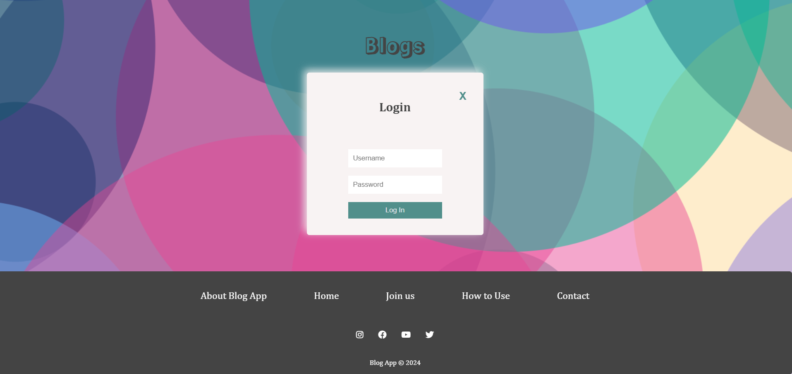
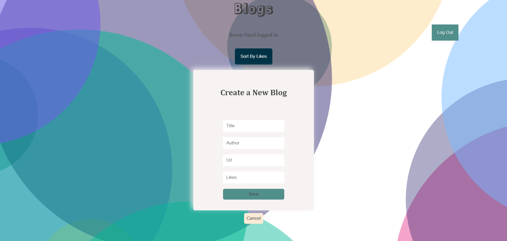
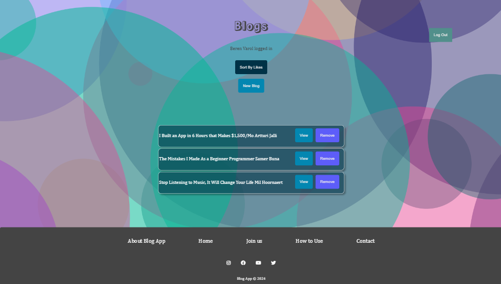

# Blog App

A simple blog app with a focus on both frontend and backend. This application allows users to add/ delete favorite blogs.

# Visual of the project

# Features

- Add new favorite blogs with details of blog(title, author, url and likes)
- Delete blogs from the list
- Sort blogs by likes

# Built with

- Frontend: HTML, CSS, JavaScript, React
- Backend: Node.js, Express.js
- Database: MongoDB

# Testing

- Unit testing: The frontend code is tested using Jest framework. Run tests with the command: `npm test`
- Integration testing: The backend API endpoints are testes using Jest framework. Run tests with the command: `npm test`
- End-to-end testing: The application is tested using Cypress for end-to-end scenarios, ensuring smooth interaction between frontend and backend.
  -To run end-to-end tests:

Make sure your backend is running in test mode `npm run start:test`

1. In Frontend, start project, `npm run dev`
2. In a seperate terminal of test project, run Cypress: `npm run cypress:open`
3. Cypress asks what type of tests you want to choose, choose "E2E Testing", then click "Create new spec"
4. Cypress Test Runner will open. Click on a test file to run the tests in the browser.

# Reach Phonebook

Frontend Code, [BlogApp Frontend](https://github.com/berenvrl/blogApp-FE)

Backend Code, [BlogApp Backend](https://github.com/berenvrl/blogApp)

Test Project, [BlogApp Test](https://github.com/berenvrl/blogApp-CypressTest)

# Whole Project

Deployed project as whole, [BlogApp FullStack Project](https://blogapp-7777.onrender.com/)

To login, please use this credentials:
username:testUser
password:test123,

# Installation

1. Clone the repository
2. Install dependencies:`npm install`
3. Start the server: `npm run dev`
4. Open the app in your browser